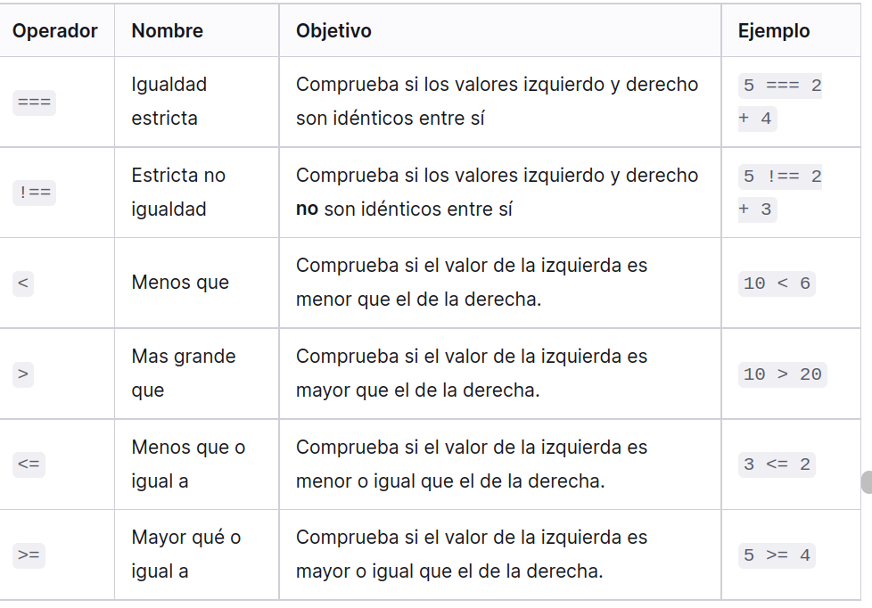

# Fundamentos de Java

¿Cómo se declara una variable?
¿Cuáles son las tres formas diferentes de declarar una variable?
¿Cuál deberías usar cuando?
¿Cuáles son las reglas para nombrar variables?
¿Qué son los operadores, operandos y operaciones?
¿Qué es la concatenación y qué sucede cuando sumas números y cadenas?
¿Cuáles son los diferentes tipos de operadores en JavaScript?
¿Cuál es la diferencia entre ==y ===?
¿Qué son los valores de precedencia de operadores?
¿Qué son los operadores de incremento/decremento?
¿Cuál es la diferencia entre prefijarlos y posfijarlos?
¿Qué son los operadores de asignación?
¿Qué es el Operador “Unario +”?

# Abrir una consola java

<script>
    // your JavaScript goes here!
    console.log("Hello,world")  
</script>

# console.log() : es el comando para imprimir algo en la consola

# Variables

son contenedores para almacenar codigo javascript antiguamente se declaraba con var ahora con se declara con let y const.

# let variable

declarando en una linea y multilineas

<script>
    let user = 'john!';
    let age = '25';
    
    
    // multilinea
    let user = 'john' age = '25';

    //coma adelante o coma atras 

    let user = 'john',
     age = '25';


    // adelante
    let user = 'john' 
    , age = '25';


</script>

# conts

solo se debe usar cuando estemos seguros de que la variable no se va a cambiar

<script>
const myBirdthay = 3/7/1985
myBirthday = '01.01.2001'; // error, can't reassign the constant!
</script>

# Constantes en mayusculas

Esto es una practica que se utiliza para recordar valores dificiles de recordar.

se pueden nombrar con mayusculas y guiones bajos

<script>
const COLOR_RED = "#F00";
const COLOR_GREEN = "#0F0";
const COLOR_BLUE = "#00F";
const COLOR_ORANGE = "#FF7F00";

// ...when we need to pick a color
let color = COLOR_ORANGE;
alert(color); // #FF7F00
</script>

# Beneficios:

COLOR_ORANGEes mucho más fácil de recordar que "#FF7F00".
Es mucho más fácil escribir mal "#FF7F00"que COLOR_ORANGE.
Al leer el código, COLOR_ORANGEes mucho más significativo que #FF7F00.

Ser una "constante" solo significa que el valor de una variable nunca cambia. Pero hay constantes que se conocen antes de la ejecución (como un valor hexadecimal para el rojo) y hay constantes que se calculan en tiempo de ejecución, durante la ejecución, pero que no cambian después de su asignación inicial.

Por ejemplo:

<script>
const pageLoadTime = /* time taken by a webpage to load */;
</script>

El valor de pageLoadTimeno se conoce antes de la carga de la página, por lo que normalmente se nombra. Pero sigue siendo una constante porque no cambia después de la asignación.

En otras palabras, las constantes con nombre en mayúsculas solo se usan como alias para valores "codificados".

Aquí tenemos una birthdayfecha constante y agese calcula birthdaycon la ayuda de algún código (no se proporciona por brevedad y porque los detalles no importan aquí).

¿Sería correcto usar mayúsculas para birthday? para age? ¿O incluso para ambos?

<script>
    const BIRTHDAY = '18.04.1982'; // make uppercase?
    
    const AGE = someCode(BIRTHDAY); // make uppercase?
</script>

Generalmente usamos mayúsculas para las constantes que están "codificadas". O, en otras palabras, cuando el valor se conoce antes de la ejecución y se escribe directamente en el código.

En este código, birthdayes exactamente así. Así que podríamos usar mayúsculas para ello.

Por el contrario, agese evalúa en tiempo de ejecución. Hoy tenemos una edad, un año después tendremos otra. Es constante en el sentido de que no cambia a través de la ejecución del código. Pero es un poco "menos constante" que birthday: se calcula, por lo que debemos mantener las minúsculas para ello.

# Los numeros

JavaScript Arithmetic Operators
Arithmetic operators perform arithmetic on numbers (literals or variables).

Operator Description

- Addition

* Subtraction

- Multiplication
  \*\* Exponentiation (ES2016)
  / Division
  % Modulus (Remainder)
  ++ Increment
  -- Decrement

Términos: "unario", "binario", "operando"
Antes de continuar, comprendamos una terminología común.

Un operando : es a lo que se aplican los operadores. Por ejemplo, en la multiplicación de 5 \* 2 hay dos operandos: el operando izquierdo es 5y el operando derecho es 2. A veces, la gente llama a estos "argumentos" en lugar de "operandos".

Un operador es unario si tiene un solo operando. Por ejemplo, la negación unaria -invierte el signo de un número:

let x = 1;

x = -x;`
alert( x ); // -1, unary negation was applied

Un operador es binario si tiene dos operandos. El mismo menos también existe en forma binaria:

let x = 1, y = 3;
alert( y - x ); // 2, binary minus subtracts values

Recordatorio %
El operador resto %, a pesar de su apariencia, no está relacionado con porcentajes.

El resultado de a % bes el resto de la división entera de apor b.

Por ejemplo:

alert( 5 % 2 ); // 1, a remainder of 5 divided by 2
alert( 8 % 3 ); // 2, a remainder of 8 divided by 3
Exponenciación **
El operador de exponenciación se a ** beleva aa la potencia de b.

En matemáticas escolares, lo escribimos como a b .

Por ejemplo:

alert( 2 ** 2 ); // 2² = 4
alert( 2 ** 3 ); // 2³ = 8
alert( 2 \*\* 4 ); // 2⁴ = 16
Al igual que en matemáticas, el operador de exponenciación también se define para números no enteros.

Por ejemplo, una raíz cuadrada es una potenciación por ½:

alert( 4 ** (1/2) ); // 2 (power of 1/2 is the same as a square root)
alert( 8 ** (1/3) ); // 2 (power of 1/3 is the same as a cubic root)
Concatenación de cadenas con binario +
Conozcamos las características de los operadores de JavaScript que están más allá de la aritmética escolar.

Por lo general, el operador más +suma números.

Pero, si el binario +se aplica a las cadenas, las fusiona (concatena):

let s = "my" + "string";
alert(s); // mystring
Tenga en cuenta que si alguno de los operandos es una cadena, el otro también se convierte en una cadena.

Por ejemplo:

alert( '1' + 2 ); // "12"
alert( 2 + '1' ); // "21"
Mira, no importa si el primer operando es una cadena o el segundo.

He aquí un ejemplo más complejo:

alert(2 + 2 + '1' ); // "41" and not "221"
Aquí, los operadores trabajan uno tras otro. El primero +suma dos números, por lo que devuelve 4, luego el siguiente le +agrega la cadena 1, por lo que es como 4 + '1' = '41'.

alert('1' + 2 + 2); // "122" and not "14"
Aquí, el primer operando es una cadena, el compilador también trata los otros dos operandos como cadenas. El 2se concatena con '1', por lo que es como '1' + 2 = "12"y "12" + 2 = "122".

El binario +es el único operador que admite cadenas de este modo. Otros operadores aritméticos funcionan solo con números y siempre convierten sus operandos en números.

Aquí está la demostración de resta y división:

alert( 6 - '2' ); // 4, converts '2' to a number
alert( '6' / '2' ); // 3, converts both operands to numbers
Conversión numérica, unaria +
El plus +existe en dos formas: la forma binaria que usamos arriba y la forma unaria.

El plus unario o, en otras palabras, el operador más +aplicado a un solo valor, no hace nada con los números. Pero si el operando no es un número, el más unario lo convierte en un número.

Por ejemplo:

```javascript
// No effect on numbers
let x = 1;
alert(+x); // 1

let y = -2;
alert(+y); // -2

// Converts non-numbers
alert(+true); // 1
alert(+""); // 0
```

En realidad, hace lo mismo que Number(...), pero es más corto.

La necesidad de convertir cadenas en números surge muy a menudo. Por ejemplo, si obtenemos valores de campos de formulario HTML, generalmente son cadenas. ¿Y si queremos sumarlas?

El plus binario los agregaría como cadenas:

let apples = "2";
let oranges = "3";

alert( apples + oranges ); // "23",

the binary plus concatenates strings
Si queremos tratarlos como números, debemos convertirlos y luego sumarlos:

let apples = "2";
let oranges = "3";

// both values converted to numbers before the binary plus
alert( +apples + +oranges ); // 5

// the longer variant
// alert( Number(apples) + Number(oranges) ); // 5

---

# tipos de numeros

En programación, incluso el humilde sistema numérico decimal que todos conocemos tan bien es más complicado de lo que piensas. Usamos diferentes términos para describir diferentes tipos de números decimales, por ejemplo:

### 1. Los enteros

son números de coma flotante sin fracción. Pueden ser positivos o negativos, por ejemplo, 10, 400 o -5.

### 2. Los números de coma flotante (floats)

tienen puntos decimales y posiciones decimales, por ejemplo, 12,5 y 56,7786543.
Los dobles son un tipo específico de número de coma flotante que tiene una mayor precisión que los números de coma flotante estándar (lo que significa que tienen una precisión de una mayor cantidad de lugares decimales).

## typeof

se utiliza para verificar el tipo de variable.

## toFixed()

se uttiliza para redondeara los decimales

**_los numeros con comillas se vuelven cadenas en vez de sumarse se colocan como lectura_**

```javascript
let hola = "5"; //string
let hola = 5; //number
```

# operadores aritmeticos

Son los operadores basicos que utilizamos para hacer sumas en java script:

- Suma Suma dos números juntos.
  6 + 9

* Sustracción Resta el número de la derecha del de la izquierda. 20 - 15

- Multiplicación Multiplica dos números juntos. 3 \* 7

/ División Divide el número de la izquierda por el de la derecha. 10 / 5

% Resto (a veces llamado módulo)
Devuelve el resto que queda después de dividir el número de la izquierda en un número de porciones enteras iguales al número de la derecha.

8 % 3(devuelve 2, ya que tres entran dos veces en 8, dejando 2 sobrantes).

** Exponente Eleva un basenúmero a la exponentpotencia, es decir, el basenúmero multiplicado por sí mismo, exponentveces. Se introdujo por primera vez en EcmaScript 2016. 5 ** 2(devuelve 25, que es lo mismo que 5 \* 5).

# precedencia del operador

las precedencias de operadores en javaScritp son las mismas que las expreciones en matematicas, se calcula divisiones y las multiplicaciones primero
si queremos cambiar la procedencia coocamos un parentesis entre ellas.

num2 + num1 / 8 + 2;
(num2 + num1) / (8 + 2);

# Operadores de incremento y decremento

estos aumentan el valor de un numero o disminuyen el valor (++ ; --;) con los signos a la derecha la consola te devuelve el miso numero pero cuando declaras la variable colocada da el resultado colocado,

pero si los signos se colocan a la izquierda el resustado se devuelve inmediatamente.

```javascript
let counter = 2;
counter++; // works the same as counter = counter + 1, but is shorter
alert(counter); // 3
```

```javascript
let counter = 2;
counter--; // works the same as counter = counter - 1, but is shorter
alert(counter); // 1
```

**Los operadores ++y --se pueden colocar antes o después de una variable.**

- Cuando el operador va después de la variable, está en “forma de postfijo”: counter++.

- La “forma de prefijo” es cuando el operador va antes de la variable: ++counter.

# operadores de asignacion.

Los operadores de asignación son operadores que asignan un valor a una variable. Ya usamos el más básico, =, muchas veces — simplemente asigna a la variable de la izquierda, el valor de la derecha:

```javascript
var x = 3; // x contiene el valor 3
var y = 4; // y contiene el valor 4
x = y; // x ahora contiene el mismo valor de y... 4
```

Pero hay algunos tipos más complejos, que proporcionan atajos útiles para mantener tu código más ordenado y más eficiente. Los más comunes se enumeran a continuación.:

Operador Nombre Propósito
\_Ejemplo **Atajo_de**

+= Adición asignación Suma el valor de la derecha al valor de la variable de la izquierda y returna el nuevo valor x = 3;

```
x += 4; x = 3;
x = x + 4;
```

-= Resta asignación
Resta el valor de la derecha, del valor de la variable de la izquierda y retorna el nuevo valor.

```
x = 6;
x -= 3; x = 6;
x = x - 3;
```

\*= Multiplicación asignación
Multiplica el valor de la variable en la izquierda por el valor en la derecha y retorna el nuevo valor.

```
x = 2;
x _= 3; x = 2;
x = x _ 3;
```

/= División asignación
Divide el valor de la variable en la izquierda por el valor de la derecha y retorna el nuevo valor.

```
x = 10;
x /= 5; x = 10;
x = x / 5;
```

Intenta digitar algunos de estos ejemplos en tu consola, para darte una idea de cómo funcionan. Mira si puedes preguntar los valores que tenían antes de ingresarlos en la segunda línea, en cada caso.

Ten en cuenta que puedes usar otras variables en el lado derecho de cada expresión, por ejemplo:

```
var x = 3; // x contiene el valor 3
var y = 4; // y contiene el valor 4
x \*= y; // x ahora contiene el valor 12
```

# operadores de comparacion

se utiliza paa hacer pruebas de comparacion se true/false y actuar en consecuencia.



# operadores bit a bit

os operadores bit a bit tratan los argumentos como números enteros de 32 bits y funcionan en el nivel de su representación binaria.

Estos operadores no son específicos de JavaScript. Son compatibles con la mayoría de los lenguajes de programación.

**La lista de operadores:**

- Y ( &)
- O ( |)
- XOR ( ^)
- NO ( ~)
- MAYÚS IZQUIERDA ( <<)
- MAYÚS DERECHA ( >>)
- DESPLAZAMIENTO A LA DERECHA DE LLENADO CERO ( >>>)

# Coma

El operador coma ,es uno de los operadores más raros e inusuales. A veces, se usa para escribir código más corto, por lo que necesitamos saberlo para entender lo que está pasando.

El operador coma nos permite evaluar varias expresiones, dividiéndolas con una coma ,. Cada uno de ellos se evalúa pero solo se devuelve el resultado del último.

**Por ejemplo:**

```javascript
let a = (1 + 2, 3 + 4);

alert(a); // 7 (the result of 3 + 4)
```

> La coma tiene una precedencia muy baja.
> Tenga en cuenta que el operador coma tiene una precedencia muy baja, inferior a =, por lo que los paréntesis son importantes en el ejemplo anterior.

> Sin ellos: a = 1 + 2, 3 + 4evalúa +primero, sumando los números en a = 3, 7, luego el operador de asignación =asigna a = 3y el resto se ignora. (a = 1 + 2), 3 + 4 es como

```javascript
"" + 1 + 0 = "10" // (1)
"" - 1 + 0 = -1 // (2)
true + false = 1
6 / "3" = 2
"2" * "3" = 6
4 + 5 + "px" = "9px"
"$" + 4 + 5 = "$45"
"4" - 2 = 2
"4px" - 2 = NaN
"  -9  " + 5 = "  -9  5" // (3)
"  -9  " - 5 = -14 // (4)
null + 1 = 1 // (5)
undefined + 1 = NaN // (6)
" \t \n" - 2 = -2 // (7)

```

1. La suma con una cadena "" + 1se convierte 1en una cadena: "" + 1 = "1", y luego tenemos "1" + 0, se aplica la misma regla.

2. La resta -(como la mayoría de las operaciones matemáticas) solo funciona con números, convierte una cadena vacía ""en 0.

3. La suma con una cadena agrega el número 5a la cadena.

4. La resta siempre se convierte en números, por lo que hace " -9 "un número -9(ignorando los espacios a su alrededor).
   nullse convierte 0después de la conversión numérica.

5. undefinedse convierte NaNdespués de la conversión numérica.

6. Los caracteres de espacio se eliminan del inicio y final de la cadena cuando una cadena se convierte en un número.

7. Aquí toda la cadena consta de caracteres de espacio, como \t, \ny un espacio "regular" entre ellos. Entonces, de manera similar a una cadena vacía, se convierte en 0.

# Precedencia del operador

Si una expresión tiene más de un operador, el orden de ejecución se define por su precedencia o, en otras palabras, el orden de prioridad predeterminado de los operadores.

De la escuela, todos sabemos que la multiplicación en la expresión 1 + 2 \* 2debe calcularse antes que la suma. Eso es exactamente lo de precedencia. Se dice que la multiplicación tiene mayor precedencia que la suma.

Los paréntesis anulan cualquier precedencia, por lo que si no estamos satisfechos con el orden predeterminado, podemos usarlos para cambiarlo. Por ejemplo, escribe **(1 + 2) \* 2.**

Hay muchos operadores en JavaScript. Cada operador tiene un número de precedencia correspondiente. El que tiene el número mayor se ejecuta primero. Si la precedencia es la misma, el orden de ejecución es de izquierda a derecha.

Aquí hay un extracto de la tabla de precedencia (no necesita recordar esto, pero tenga en cuenta que los operadores unarios son más altos que los binarios correspondientes):


# Conversión numérica, unaria +

El plus +existe en dos formas: la forma binaria que usamos arriba y la forma unaria.

El plus unario o, en otras palabras, el operador más +aplicado a un solo valor, no hace nada con los números. Pero si el operando no es un número, el más unario lo convierte en un número.

Por ejemplo:

```javascript
// No effect on numbers
let x = 1;
alert(+x); // 1

let y = -2;
alert(+y); // -2

// Converts non-numbers
alert(+true); // 1
alert(+""); // 0
```

> En realidad, hace lo mismo que Number(...), pero es más corto.

La necesidad de convertir cadenas en números surge muy a menudo. Por ejemplo, si obtenemos valores de campos de formulario HTML, generalmente son cadenas. ¿Y si queremos sumarlas?

El plus binario los agregaría como cadenas:

```javascript
let apples = "2";
let oranges = "3";
```

alert( apples + oranges ); // "23", the binary plus concatenates strings
Si queremos tratarlos como números, debemos convertirlos y luego sumarlos:

```javascript
let apples = "2";
let oranges = "3";

// both values converted to numbers before the binary plus
alert(+apples + +oranges); // 5

// the longer variant
// alert( Number(apples) + Number(oranges) ); // 5
```

Desde el punto de vista de un matemático, la abundancia de ventajas puede parecer extraña. Pero desde el punto de vista de un programador, no hay nada especial: las ventajas unarias se aplican primero, convierten cadenas en números y luego las sumas binarias.

¿Por qué se aplican ventajas unarias a los valores anteriores a los binarios? Como veremos, eso se debe a su mayor precedencia .
